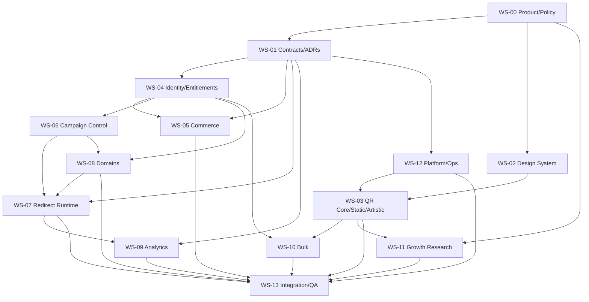

# Dependency Graph and Parallel Waves

## Hard-dependency DAG

This diagram is conservative. WS-05 can implement against mocked claims after the identity contract freezes; WS-09 can implement against synthetic scan fixtures; WS-07 can implement against route fixtures before WS-06 exists.

## Artistic-first execution waves

### Wave A0 — Creative and technical proof

- Freeze the Artistic MVP brief and quality rubric.
- Execute SP-01 QR fidelity and SP-08 artistic feasibility only.
- Prototype at least six meaningfully distinct art directions.
- Establish independent decoder, perturbation, print/device, safety, privacy, latency, and cost evidence.

**Exit:** the team can repeatedly produce compelling artistic candidates and repair them to the proposed export threshold; sponsor approves the creative bar and pipeline direction.

### Wave A1 — Contracts and vertical prototype

- Freeze `qr-core-api.v1`, `artistic-qr-api.v1`, ADR-008, and owned write surfaces.
- Build one complete thin slice: payload → art direction → four candidates → validation/repair → high-resolution export.
- Establish minimal provider secrets, telemetry, cost caps, CI, and independent test harness.

**Exit:** one production-shaped art direction completes AJ-08 end to end without accounts or broader infrastructure.

### Wave A2 — Flagship Studio

- Implement the full premium interaction model and six+ launch art directions.
- Add candidate comparison, refinement/variation, local/session continuity, print preview, deterministic fallback, accessibility, and responsive browser performance.
- Continuously exercise the independent scan/safety matrix.

**Exit:** all Artistic MVP requirements pass shared contracts and real integrated evidence.

### Wave A3 — Hardening and release

- Adversarial scan, content-safety, privacy, provider-failure, cost-cap, accessibility, performance, and browser/device drills.
- Production-shaped deployment, rollback/feature-disable, support guidance, and post-deploy synthetic generation/validation proof.
- Independent AJ-01/AJ-08 release recommendation.

**Exit:** the standalone Artistic QR Studio passes the sponsor-approved creative and reliability bar and is released or explicitly held.

### Deferred Waves B+ — Infrastructure around the proven core

Accounts/commerce, dynamic campaigns, redirect/analytics, custom domains, bulk, teams, and APIs remain dormant until the Artistic MVP passes Wave A3 and the sponsor authorizes the next release. Their existing DAG documents future boundaries but does not authorize parallel implementation.

## Critical paths

**Artistic MVP:** WS-00 creative brief → SP-01/SP-08 → WS-01 artistic contracts/ADR-008 → WS-02/WS-03 + minimal WS-12 → WS-13 independent release proof.
**Dynamic launch:** WS-00 → WS-01 → WS-04 → WS-06 → WS-07 → WS-13, with WS-05 required for paid activation.  
**Custom domains:** SP-04/ADR-005 → WS-04/06 → WS-08 → WS-07 → WS-13.  
**Bulk paid launch:** SP-01/WS-03 + SP-02 + WS-04/05 → WS-10 → WS-13.

## Irreversible/high-cost decisions

- Public “forever/lifetime/unlimited” promise.
- Canonical route domain and slug permanence.
- Provider-specific custom-hostname model.
- Identity and tenant model after customers exist.
- Event/analytics retention and privacy representation.
- Entitlement/refund behavior for printed assets.

These require explicit owner approval and ADR/policy evidence before implementation lock-in.
