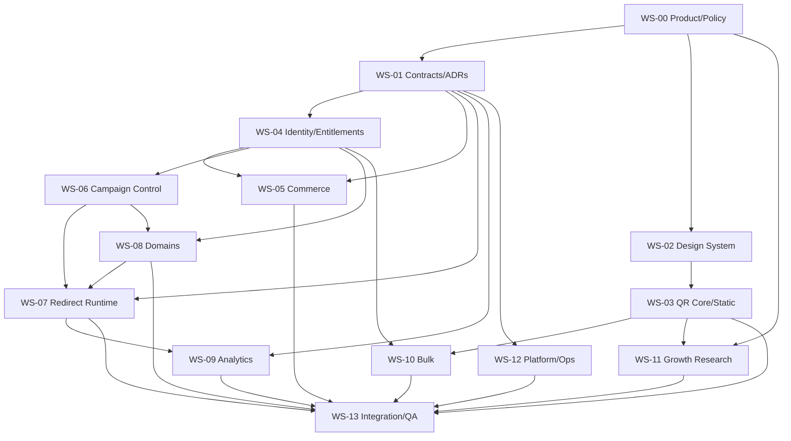

# Dependency Graph and Parallel Waves

## Hard-dependency DAG

This diagram is conservative. WS-05 can implement against mocked claims after the identity contract freezes; WS-09 can implement against synthetic scan fixtures; WS-07 can implement against route fixtures before WS-06 exists.

## Parallel waves

### Wave 0 — Decisions and evidence

- WS-00 charter/PRD, competitor validation, interviews, economics and policy.
- WS-01 preliminary architecture boundaries.
- Spikes SP-01 through SP-07 assigned to future owners.

**Exit:** dangerous promises are qualified; MVP scope and measurable NFRs accepted.

### Wave 1 — Foundations and feasibility

- WS-01 contracts/ADRs.
- WS-02 design system foundations.
- WS-03 QR fidelity spike.
- WS-08 custom-domain spike.
- WS-10 bulk envelope spike.
- WS-11 demand/SEO research only.
- WS-12 environments/CI/telemetry baseline.
- WS-13 contract/E2E harness skeleton.

**Exit:** machine-readable contract v1 candidates; spike verdicts; no fatal economics/architecture blocker.

### Wave 2 — Independently mockable cores

- WS-03 static implementation.
- WS-04 identity/entitlements.
- WS-05 commerce against claims/event mocks.
- WS-07 redirect runtime against route/hostname fixtures.
- WS-09 analytics against scan fixtures.
- WS-12 staging infrastructure.

**Exit:** contract tests pass and each core works with shared fixtures.

### Wave 3 — Stateful feature composition

- WS-06 campaign control.
- WS-08 custom domains if validated.
- WS-10 bulk engine after QR Core/entitlement contracts.
- WS-11 initial high-quality landing-page family.
- WS-13 continuous integration.

**Exit:** AJ-01 through AJ-05 pass in staging.

### Wave 4 — Hardening and launch

- Abuse/security/privacy testing.
- Backup/restore and provider-failure drills.
- Terms/refund/continuity publication.
- Accessibility/performance/browser matrix.
- AJ-06/AJ-07 plus rollback and post-deploy proof.

## Critical paths

**Static launch:** WS-00 → WS-02 → SP-01/WS-03 → WS-13.  
**Dynamic launch:** WS-00 → WS-01 → WS-04 → WS-06 → WS-07 → WS-13, with WS-05 required for paid activation.  
**Custom domains:** SP-04/ADR-005 → WS-04/06 → WS-08 → WS-07 → WS-13.  
**Bulk paid launch:** SP-01/WS-03 + SP-02 + WS-04/05 → WS-10 → WS-13.

## Irreversible/high-cost decisions

- Public “forever/lifetime/unlimited” promise.
- Canonical route domain and slug permanence.
- Provider-specific custom-hostname model.
- Identity and tenant model after customers exist.
- Event/analytics retention and privacy representation.
- Entitlement/refund behavior for printed assets.

These require explicit owner approval and ADR/policy evidence before implementation lock-in.
